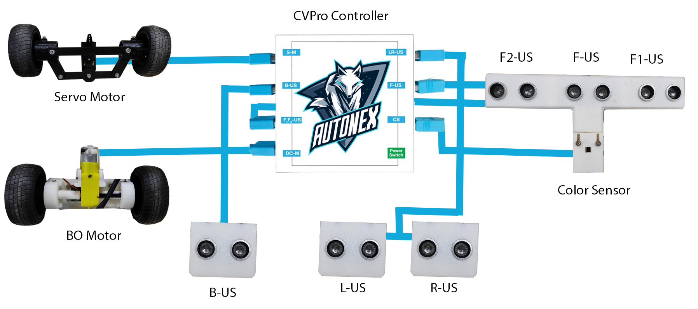

# 🤖 AutoNex Bot Documentation 2025
AutoNex Bot is a 4-wheel robot DIY kit. We are participating in the WRO Future Engineers category for the year 2025.

---

## 1️⃣ Hardware Provided

### 1.1 🖥️ CVPro Controller
The **CVPro Controller** is based on the **ESP32 microcontroller** and efficiently processes sensor data.  
It includes:
- 🌈 **RGB LED** for status indication.
- 🔘 **Start pushbutton** to initiate programmed tasks.
- 🔋 **Integrated 3200 mAh battery** with a built-in charging module.

---

### 1.2 🛞 Servo Motor with Ackermann Steering System
- 🎯 Provides precise directional control.
- 🚗 Replicates the steering mechanism of real-world vehicles for smooth and efficient turns.

---

### 1.3 ⚙️ BO Motor
- 🔄 Drives the robot’s **forward and backward** movement.

---

### 1.4 🎨 Color Sensor
- 🕵️‍♂️ Detects colored paths or zones on the ground.
- 📍 Ideal for **line-following** or **zone-based navigation** tasks.

---

### 1.5 📡 Ultrasonic Sensors (6 Units)
- 🔷 **Front (3)**: Detects obstacles ahead with enhanced accuracy.
- 🔶 **Rear (1)**: Improves safety during reverse movement.
- ↔ **Left (1)** & **Right (1)**: Enables lateral obstacle detection and supports wall-following tasks.

---

### 1.6 📱 Mobile Phone Holder with OTG Cable
- 📌 Securely holds a mobile device.
- 🎥 Enables **image processing**, **remote control**, or **augmented vision**.

---

## 2️⃣ Software Used

### 2.1 💻 Arduino IDE
- 🖊️ Cross-platform programming environment used to write, compile, and upload code to the **CVPro Controller**.

### 2.2 🧩 Arduino C++
- ⚡ Programming language used to control motors, sensors, and other components of the **CVPro Bot**.

### 2.3 📲 CVPro Android Mobile Application
- 👁️ Dedicated app for **computer vision–based tasks** like object detection, tracking, and image processing.

---

## 3️⃣ Dimensions and Weight
- 📏 **Length:** 280 mm  
- 📏 **Breadth:** 190 mm  
- 📏 **Height:** 250 mm  
- ⚖️ **Weight:** 975 g *(without mobile phone)*, 1,120 g *(with mobile phone)*

---

## 4️⃣ Wiring Diagram & Components Provided

### 4.1 🖥️ CVPro Controller
- Central hub for controlling motors and sensors.
- Labeled ports for **S-M**, **DC-M**, **US sensors**, **CS**.

### 4.2 ⚙️ Motors
- **Servo Motor (S-M port)**: Mounted on the front axle for Ackermann steering control.
- **BO Motor (DC-M port)**: Drives rear wheels for forward/backward motion.

### 4.3 📡 Ultrasonic Sensors (US)
- **F1-US**, **F-US**, **F2-US**: Three front-facing ultrasonic sensors for obstacle detection in front.
- **B-US**: Rear-facing ultrasonic sensor for detecting obstacles behind.
- **L-US**: Left-side ultrasonic sensor for side obstacle detection.
- **R-US**: Right-side ultrasonic sensor for side obstacle detection.

### 4.4 🎨 Color Sensor (CS port)
- Positioned below the front ultrasonic sensors.
- Detects surface colors for line following, object sorting, or vision-based tasks.

### 4.5 🔋 Power Supply
- **18650 Li-ion battery** powers the CVPro Controller and components.
- On/Off power switch integrated into the controller.

### 4.6 🧵 Wiring Layout
- 🔵 **Blue cables** represent signal/power connections from the CVPro Controller to each device.
- Each sensor/motor is connected to its **dedicated labeled port** for organized wiring.

  

---

