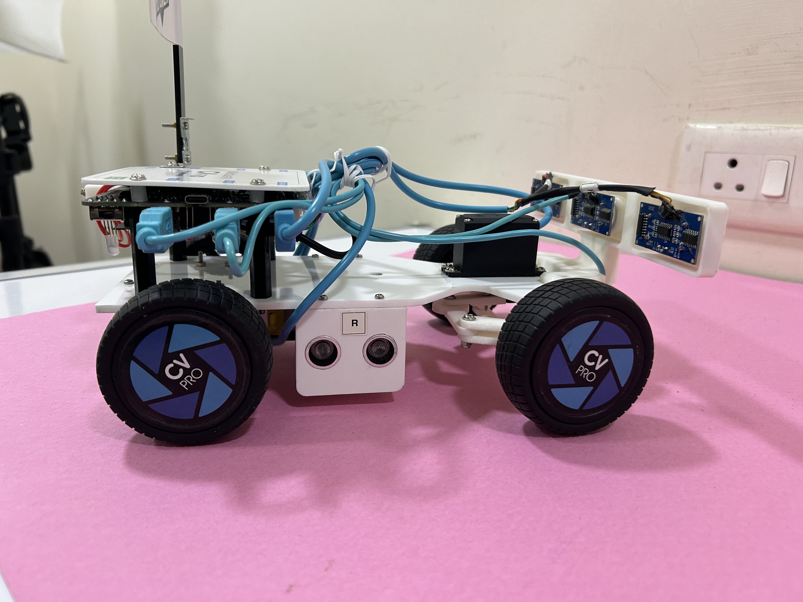
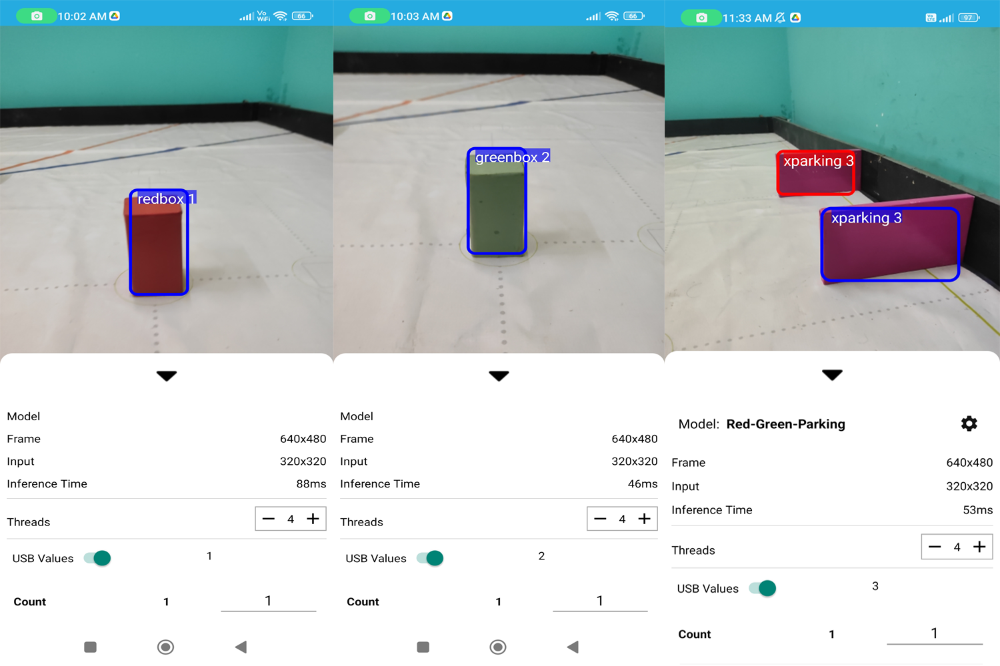
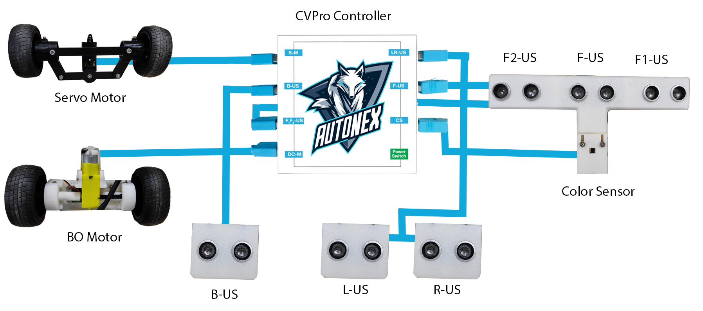

# 🤖 AutoNex Bot Documentation 2025  

The **AutoNex Bot** is a 4-wheel DIY robot kit designed for participation in the **WRO Future Engineers Category 2025**.  

  

---

## 🎥 WRO Future Engineers Performance Videos  

1. **WRO Future Engineers 2025 – Open Challenge** : 🎥 [Watch on YouTube](https://www.youtube.com/watch?v=euu-VfOtzoA)

2. **WRO Future Engineers 2025 – Obstacle Challenge** : 🎥 [Watch on YouTube](https://www.youtube.com/watch?v=0B_U6UpkoQk)

3. **WRO Future Engineers 2025 – AutoNex Team Discussion** : 🎥 [Watch on YouTube](https://www.youtube.com/watch?v=cgD9jgNYa6U)

---

## 1️⃣ Hardware Provided  

### 🖥️ CVPro Controller  
Based on the **ESP32 microcontroller** for efficient sensor data processing.  

**Features:**  
- RGB LED for status indication.  
- Start pushbutton to initiate programmed tasks.  
- Integrated **3200 mAh battery** with built-in charging module.  

### ⚙️ Servo Motor with Ackermann Steering  
- Provides precise steering control.  
- Mimics the mechanism of real-world vehicles for smooth, efficient turns.  

### ⚡ BO Motor  
- Controls the bot’s **forward and reverse motion**.  

### 🎨 Color Sensor  
- Detects ground colors and zones.  
- Useful for **line-following** and **zone-based navigation**.  

### 📡 Ultrasonic Sensors (6 Units)  
- **Front (3):** Detects frontal obstacles with high accuracy.  
- **Rear (1):** Ensures safe reverse movement.  
- **Left (1) & Right (1):** Enables lateral detection and wall-following navigation.  

### 📱 Mobile Holder with OTG Cable  
- Secure mount for a mobile device.  
- Supports **image processing**, **vision-based tasks**, and **remote control**.  

---

## 💻 Software Used  

- **Arduino IDE** – Cross-platform environment for writing, compiling, and uploading code to the CVPro Controller.  
- **Arduino C++** – Primary programming language used to control motors, sensors, and other components.  
- **AutoNex Android Application** – Dedicated app for tracking and object detection.  

---

## 📱 AutoNex Mobile Application  

The **AutoNex Android Mobile App** is built on a **TensorFlow Lite (TFLite) object detection model**. In the WRO Future Engineers category, it detects sign boxes (red and green) and the parking wall to guide the bot’s navigation.  

### 🔴 Red Sign Box Detection  
- Sends value **"1"** via C-to-C OTG cable.  
- Bot executes a **right turn**.  

### 🟢 Green Sign Box Detection  
- Sends value **"2"** via C-to-C OTG cable.  
- Bot executes a **left turn**.  

### 🅿️ Parking Wall Detection  
- Sends value **"3"** via C-to-C OTG cable.  
- Bot performs the **parking maneuver**.  

---

  

---

## 📐 Dimensions and Weight  

- **Length:** 280 mm  
- **Breadth:** 190 mm  
- **Height:** 250 mm  
- **Weight:** 975 g *(without mobile phone)*, 1,120 g *(with mobile phone)*  

---

## 🔌 Wiring Diagram & Components  

### CVPro Controller  
- Central hub for all motors and sensors.  
- Labeled ports: **S-M**, **DC-M**, **US**, **CS**.  

### Motors  
- **Servo Motor (S-M port):** Mounted on front axle for Ackermann steering.  
- **BO Motor (DC-M port):** Drives rear wheels for forward/backward motion.  

### Ultrasonic Sensors (US)  
- **F1-US, F-US, F2-US:** Three front-facing sensors.  
- **B-US:** Rear-facing sensor.  
- **L-US & R-US:** Side-facing sensors for obstacle detection.  

### Color Sensor (CS port)  
- Positioned below front ultrasonic sensors.  
- Detects surface colors for line following and sorting tasks.  

### Power Supply  
- **18650 Li-ion battery** integrated into CVPro Controller.  
- On/Off power switch for easy control.  

### Wiring Layout  
- **Blue cables** represent signal/power connections from the controller.  
- Each motor/sensor connects to a **dedicated labeled port** for clarity.  

---

  

---

## 📩 Contact & Socials  

- **Email:** [autonexwro2025@gmail.com](mailto:autonexwro2025@gmail.com)  
- **YouTube Channel:** [Team AutoNex WRO](https://www.youtube.com/@TeamAutonexWRO)  

